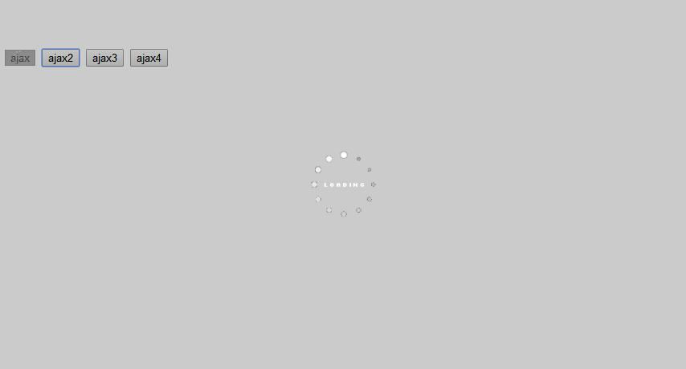

# network
ajax请求的重写,防重复点击

`它的核心还是使用$.ajax，只是在这里加上了加载效果，然后去除了重复的提交`

它的使用方法和$.ajax和$.get和$.post一致，返回的也是deferred.

效果如下图

#API
##ajax:({},target)
	ajax调用,同jquery的ajax,但多了一个target参数，
	当传入此参数时loading将在target上loading,如果不传，加载效果就是全屏的。
***
	$('#btn-send').click(function() {
		Network.ajax({
			url: "/ajax.json",
			data: "a=1",
			beforeSend: function() {
				console.log('发起请求')
			}
		},this).done(function() {
			console.log('请求结束')
		});
	});
##get:(url,data,fun,dataType)
	同jquery的get方法,以get方式的ajax请求，这里没有target，为全屏加载效果
##post:(url,data,fun,dataType)
	同$.post,以post方式的ajax请求，也是全屏的加载效果
